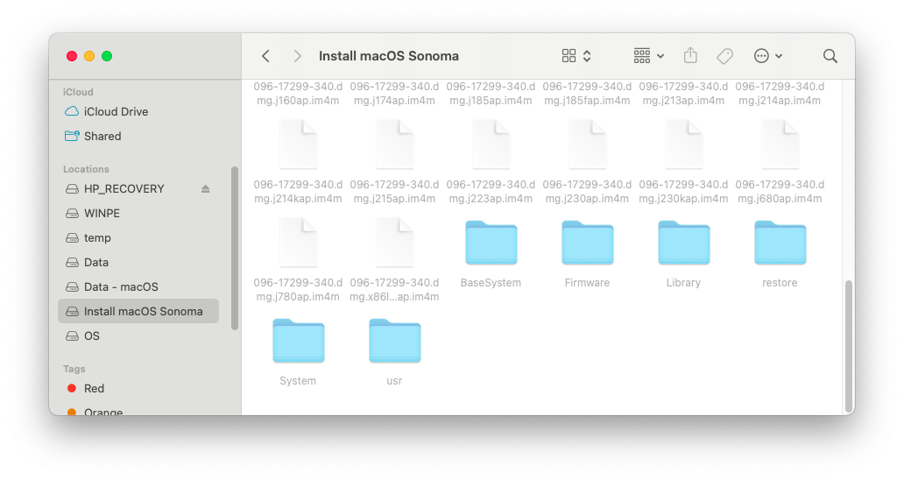
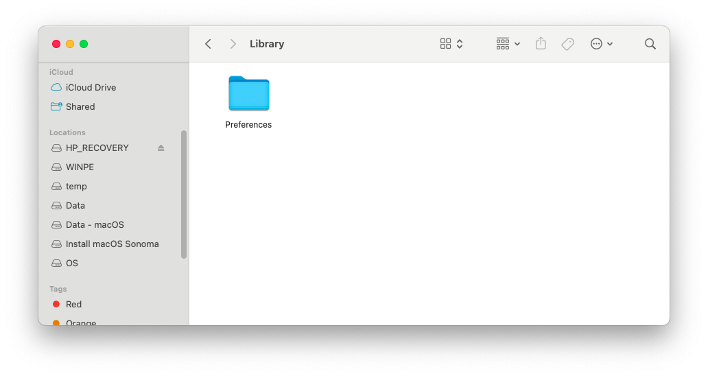
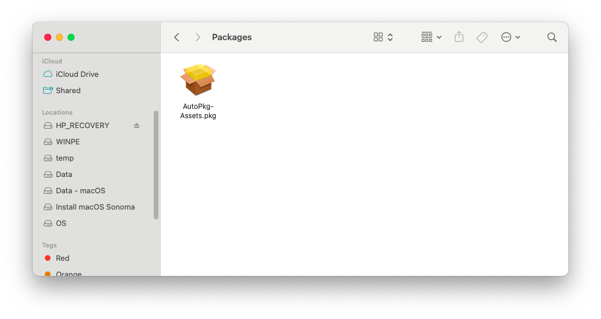

# PatchSonomaWiFiOnTheFly (PSWFOTF)
Patch modern Broadcom Wi-Fi card on the fly when doing a fresh install with macOS Sonoma

## Require

> [!NOTE]
> - Latest [`AutoPkgInstaller.kext`](https://github.com/dortania/OpenCore-Legacy-Patcher/blob/main/payloads/Kexts/Acidanthera/) from OCLP
> - Latest [`AutoPkg-Assets.pkg`](https://github.com/dortania/OpenCore-Legacy-Patcher/releases/latest/download/AutoPkg-Assets.pkg) from OCLP
> - A USB/Hard drive macOS Sonoma Installer

## 1. Prepare `config.plist`
Follow this [guide](https://github.com/perez987/Broadcom-wifi-back-on-macOS-Sonoma-by-OCLP) by [perez987](https://github.com/perez987) to prepare your `config.plist`
## 2. Prepare a USB/Hard drive macOS Installer
Follow this example [guide](https://support.apple.com/en-vn/101578) from Apple or any other sources

## 3. Prepare Kext and Pkg Files

1. Inject `AutoPkgInstaller.kext` into your OC folder then do a snapshot to `config.plist`
2. Navigate to the macOS Sonoma installer; it should look like this

3. Press Cmd (Win) + Shift + . (dot) to display hidden files and folders

4. Navigate to the hidden `Library` folder.

5. Create a new folder named `Packages`.

6. Paste `AutoPkg-Assets.pkg` into the `Packages` folder.

7. Perform a fresh install with that USB or hard drive.
8. Just wait, and everything will be done. You’ll have a native OOBE experience without losing Wi-Fi again.

> [!NOTE]
> - After a few processes, it will show the ‘percent text’ like this, which means OCLP is patching your Wi-Fi and installing OCLP to macOS.
> 
## For NootedRed users
> [!WARNING]
> - After the hard drive switches from `macOS Installer` to the name you set when formatting, like `Macintosh HD` or something like that, you should disable NootedRed before booting to that stage. After disabling NootedRed, you can boot to that disk. It will restart one more time, then enable NootedRed

 -------> 

### Special thanks to
- [dortania](https://github.com/dortania/) for [OCLP](https://github.com/dortania/OpenCore-Legacy-Patcher)
- [perez987](https://github.com/perez987) for patching Wi-Fi guide
